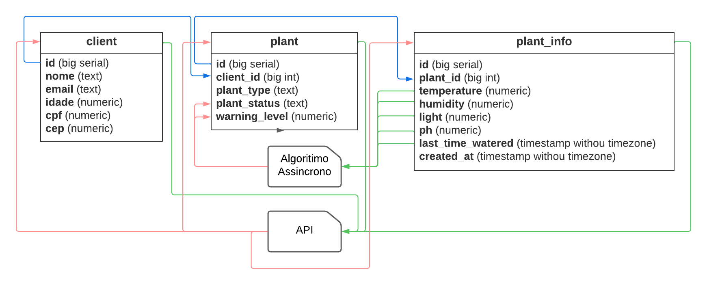
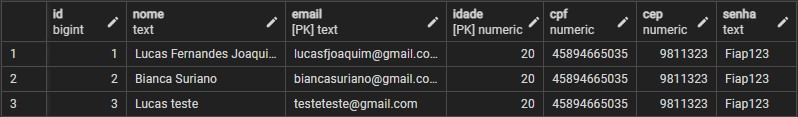
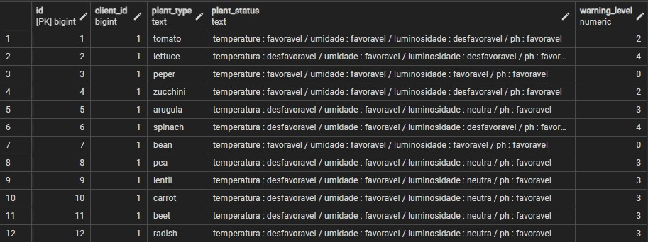
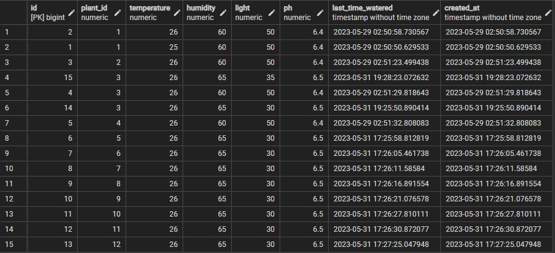

<a name="API"></a>

<br />
<div align="center">
  <a href="#">
    
  </a>
</div>

## Sobre o projeto

<div>
<p>Esta é primeira iteração do Banco de Dados do projeto Estufa Mini, estamos utilizando <a href="https://www.postgresql.org" >PostgreSQL</a> para criar este banco de dados<br>
</p>
<p>Areas que o Banco de Dados se conecta: <br>
* <a href="https://github.com/FIAP-grupo-challenge/Python_GS" >API</a> : Cadastro de clientes, Updates do cliente, Querys de informações do clientes, Querys de informações da planta<br>
* <a href="https://github.com/FIAP-grupo-challenge/Python_algoritimo_assincrono_GS" >Algoritimo Assincrono</a> : Querys de informações da planta com o intuito de devolver atualizações na tabela plant nas colunas plant_status e warning_level <br><br><br>
</p>
</div>
<div align="center">
</div>

# Hospedagem
O Banco de Dados atualmente se encontra hospedado no <a href="https://www.elephantsql.com">ElephantSQL</a> com o plano <a href="https://www.elephantsql.com/plans.html">Tiny Turtle</a>
<br>

### Motivos
1. Custo <br>
    devido do custo do plano <a href="https://www.elephantsql.com/plans.html">Tiny Turtle</a> (gratuito), ele se tornou uma opção
    extremamente recomendada para projetos em suas fases iniciais, sendo ate preferivel a trabalhar com um banco local.
2. Ausência de Contrato <br>
    A plataforma <a href="https://www.elephantsql.com">ElephantSQL</a> não exige nenhum tipo de firmação de contrato ou dados de cobramça (cartão de credito, cpf, dentre outros)
3. Cloud <br>
    trabalhar com elementos cloud no desenvolvimento minimiza dores de desenvolvimento futuras do projeto, na hora de subir o projeto para um ambiente de produção. Trabalhar com elementos cloud tambem facilitam o co-development, e possibilitam varias pessoas desenvolverem a mesma task simultaneamente.

# Estrutura
O Banco de Dados (em seu estado atual) foi estruturado com 3 tabelas simples e dois manipuladores de dados
1. Tabelas
    1. client : responsavel por guardar informações do cliente.
    2. plant : responsavel por guardar informações gerais da planta.
    3. plant_info : responsavel por guardar informações do estado da planta.
2. Manipuladores de dados
    1. <a href="https://github.com/FIAP-grupo-challenge/Python_GS" >API</a> : responsavel por interligar todas as partes do projeto, disponibiliza e modifica as informações do banco de dados.
    2. <a href="https://github.com/FIAP-grupo-challenge/Python_algoritimo_assincrono_GS" >Algoritimo Assincrono</a> : responsavel por processar as informações de estado da planta, e devolver uma resposta nas colunas plant_status e warning_levelz


## diagrama

<br><br>

# Tabelas

## client
Tabela responsavel por guardar informações do cliente <br>(senhas sem haSH por restrição de tempo)<br>

SQL: 
```SQL
SELECT * FROM client ORDER BY id
```

## plant
Tabela responsavel por guardar informações gerais da planta<br>

SQL: 
```SQL
SELECT * FROM plant ORDER BY id
```

## plant_info
Tabela responsavel por guardar informações do estado da planta<br>

SQL: 
```SQL
SELECT * FROM plant_info ORDER BY plant_id
```

# Porque PostgreSQL
1. Maturidade e estabilidade: O PostgreSQL tem uma história de desenvolvimento longa e bem estabelecida, remontando a mais de 30 anos. Ele é conhecido por sua confiabilidade, robustez e estabilidade, sendo amplamente utilizado em ambientes de produção exigentes.

2. Suporte a SQL completo: O PostgreSQL adere estritamente aos padrões ANSI SQL e oferece suporte a um amplo conjunto de recursos SQL, incluindo subconsultas, junções complexas, desencadeadores (triggers), procedimentos armazenados e muito mais. Isso torna o PostgreSQL altamente compatível com outras bases de dados e facilita a migração de aplicativos de outros sistemas de gerenciamento de banco de dados.

3. Extensibilidade: O PostgreSQL é altamente extensível, permitindo que os usuários adicionem novos tipos de dados, funções, operadores e até mesmo recursos personalizados por meio de extensões. Além disso, ele suporta várias linguagens de programação (como PL/pgSQL, PL/Python, PL/Java) para escrever procedimentos armazenados e funções personalizadas.

4. Recursos avançados: O PostgreSQL possui uma ampla gama de recursos avançados, incluindo suporte a transações ACID (Atomicidade, Consistência, Isolamento e Durabilidade), replicação síncrona e assíncrona, particionamento de tabelas, índices avançados (como índices GIN e GiST para pesquisa de texto completo e dados geométricos), entre outros. Esses recursos fornecem flexibilidade e desempenho aprimorado para uma variedade de casos de uso.

5. Suporte a dados geoespaciais: O PostgreSQL possui suporte nativo a dados geoespaciais, permitindo a realização de consultas e operações complexas em dados com componentes espaciais. Isso é particularmente útil para aplicativos de mapeamento, sistemas de informação geográfica (GIS) e análises baseadas em localização.

6. Comunidade ativa: O PostgreSQL possui uma comunidade de usuários ativa e engajada, que contribui com melhorias, correções de bugs e desenvolvimento contínuo do sistema. Essa comunidade vibrante resulta em um software de alta qualidade, suporte técnico abrangente e ampla disponibilidade de recursos e tutoriais online.

7. Licença de código aberto: O PostgreSQL é distribuído sob a licença PostgreSQL, que é uma licença de código aberto. Isso significa que você pode usá-lo, modificá-lo e distribuí-lo gratuitamente, além de ter acesso ao código-fonte completo. A licença de código aberto promove a transparência, flexibilidade e independência em relação a um fornecedor específico.

# Desenvolvedores
1. Nome: Lucas Fernandes Joaquim, RM: 551313
2. Nome: Gustavo Ferreira Lopes, RM: 98887
3. Nome: heitor freire dos anjos, RM: 552165
4. Nome: Rodrigo Fernandes dos Santos, RM: 98896
5. Nome: Enzo Silva Cataldi, RM: 99826